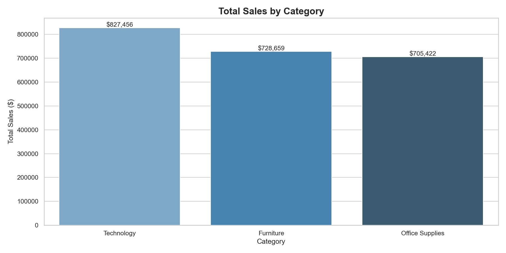
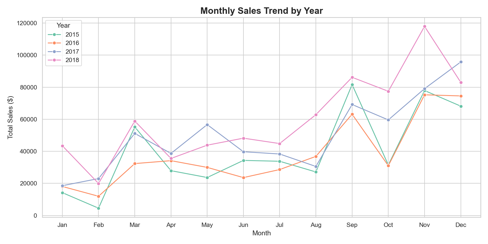
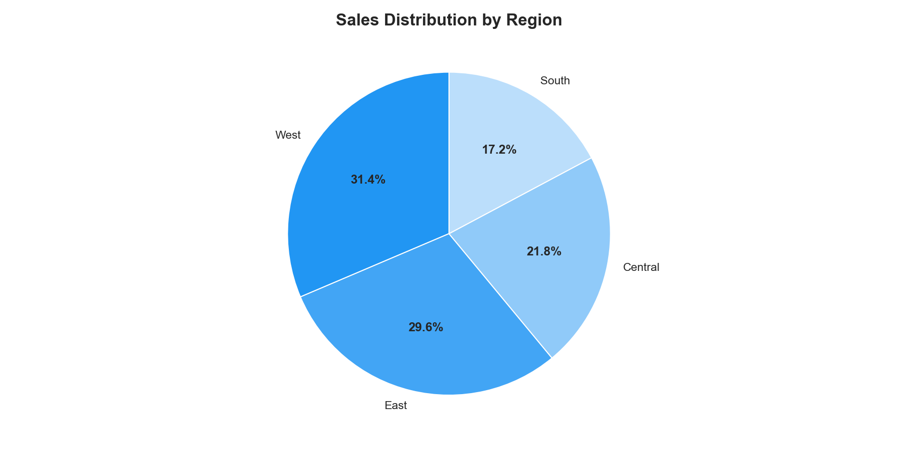
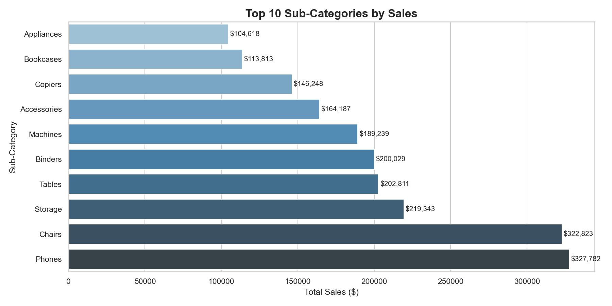

# 📊 Sales Analytics Project

Analyzing retail sales data using Python and Power BI to uncover business insights.

## 🔍 Key Findings
- **Technology** generates the highest revenue ($827K) despite fewer orders
- **West region** leads with 31.4% of total sales
- **November** is consistently the peak sales month across all years
- **Phones & Chairs** are the top-selling sub-categories

## 🛠️ Tools & Technologies
- Python 3.14 (Pandas, Matplotlib, Seaborn)
- Power BI Desktop
- Jupyter Notebook
- Git & GitHub

## 📁 Project Structure
sales-analytics/
├── data/
│   ├── train.csv              # Raw dataset
│   └── cleaned_data.csv       # Processed dataset
├── notebooks/
│   ├── 01_data_exploration    # Initial data analysis
│   ├── 02_data_cleaning       # Data cleaning & feature engineering
│   └── 03_visualization       # Charts & insights
├── reports/
│   ├── 01_sales_by_category.png
│   ├── 02_monthly_trend.png
│   ├── 03_sales_by_region.png
│   ├── 04_top_subcategories.png
│   └── sales_dashboard.pbix   # Power BI dashboard
└── src/
## 📊 Visualizations

### Sales by Category


### Monthly Sales Trend


### Sales by Region


### Top Sub-Categories


## 🚀 How to Run
1. Clone the repository
```bash
   git clone https://github.com/sarashad/sales-analytics.git
```
2. Install dependencies
```bash
   pip install -r requirements.txt
```
3. Open Jupyter notebooks in order (01 → 02 → 03)

## 📌 Dataset
[Superstore Sales Dataset](https://www.kaggle.com/datasets/rohitsahoo/sales-forecasting) from Kaggle